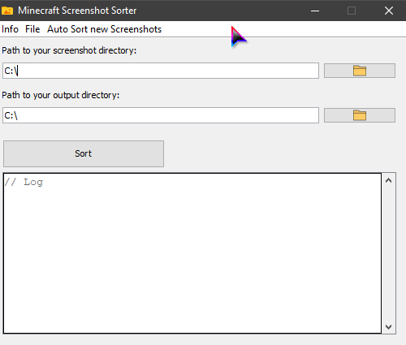

# Notice
I'm not the creator of this application, I just modified it a little bit.
[Original](https://github.com/RealCerus/MinecraftScreenshotSorter)

# GUI

# Modification 
- Added system tray icon
- Automatically sort new screenshots (Optional)

# Minecraft Screenshot Sorter (Original ReadMe)
This is a little fun project that I worked on in about 4-5 hours. It looks through your minecraft screenshots and sorts them in a nice directory structure.

## How to use
1. Choose your minecraft screenshots folder
2. Choose the preferred output directory where the screenshots will be sorted
3. Click "Sort"
4. Wait
5. Done!